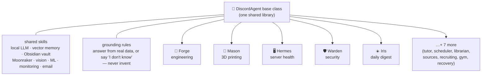

# Homelab Agent — Shared Skills Library

> A dozen personality-driven AI agents, **one shared brain**, running on a
> single second-hand mini-PC — no cloud, no GPU. This is that brain.

The shared Python library every homelab agent (Forge, Mason, Apex, Eos, Hermes,
Warden, Iris, Axiom, Kairos, Scout) builds on. An agent is just an **identity
plus a few commands** on top of this — so a capability added here lands in every
agent at once, and they all behave identically.



Full ecosystem + wiki: **[the homelab hub](https://github.com/kubinokitsune/homelab)**.

## The Step 0 contract

Before any actual skill, four foundations were locked. Every skill is written
against these:

| File | Role |
|------|------|
| `skills/config.py`  | One `config` object. Skills read hosts/secrets from it, never `os.getenv`. Validation is lazy and per-skill: a missing key only fails when a skill actually uses it, with a message naming the key and the file to fix. |
| `skills/result.py`  | The return shape. I/O skills return `Result.success(data)` or `Result.failure("reason")` — never bare booleans, never raising into the agent. |
| `skills/logging.py` | `get_logger(__name__)`. Every line is `date time  LEVEL  [Agent]  skill  message`. Stdout only (container/Loki friendly). Agent tag set via `set_agent("Forge")` at startup. |
| `skills/errors.py`  | The `@skill` decorator: any exception a skill raises is logged with a traceback and converted to `Result.failure(...)`, so a dead service never crashes an agent. |

## Skill template

```python
from skills.config import config
from skills.logging import get_logger
from skills.errors import skill
from skills.result import Result

log = get_logger(__name__)

@skill
def do_something(...) -> Result:
    host = config.qdrant_host          # config, never os.getenv
    ...                                # happy path only
    return Result.success(payload)     # failures auto-handled by @skill
```

## Setup

```bash
pip install -r requirements.txt
cp .env.example .env      # then fill in real values (never committed)
```

## A sample of the skills

~35 modules live in `skills/`; a few representative ones:

| Skill | Does | External dep |
|-------|------|--------------|
| `notifications.py` | Discord + Pushover alerts, routed by severity (INFO → EMERGENCY page) | webhooks, Pushover |
| `obsidian_vault.py` | Read/write/search the vault (frontmatter-aware, no-clobber) | the vault folder |
| `vector_store.py`   | Semantic memory: upsert/query/delete/count | Qdrant + Ollama |
| `moonraker.py` · `camera.py` · `vision.py` | Drive + watch the 3D printer | Klipper/Moonraker |
| `failure_detector.py` · `anomaly_detector.py` | Classical ML — print failures + server anomalies | scikit-learn |
| `email_reader.py` | Read-only inbox summaries | IMAP |
| `security_monitor.py` · `server_monitor.py` | Auth/firewall watch + host health | SSH to host |

## Status

All agents built and running as `systemd` services on the homelab. The library
is live against real infrastructure — a printer, a server, a vault, and a
Discord fleet — not a demo.
